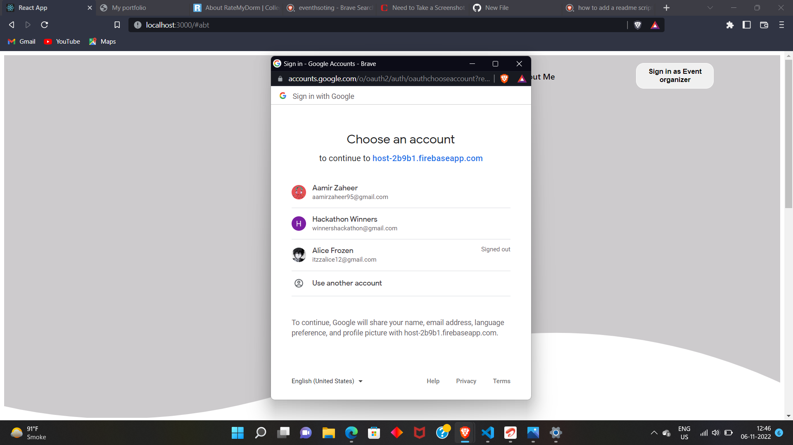

This a basic event-hosting platform 🚀

Here a Organizer needs to sign up with his google account to create a new event

Once a user is signed in he/she will be able to see a form where he can create a new event by filling the data in the form

and when he clickes the refresh button below he/she will be able to see its event history.

A organizer can read,update and delete a event that he/she has created.
But a User can only read event and register for an event by clicking on register button this functionality is comming soon!!
